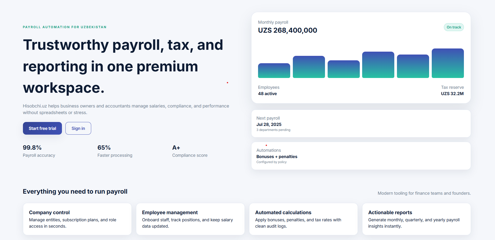
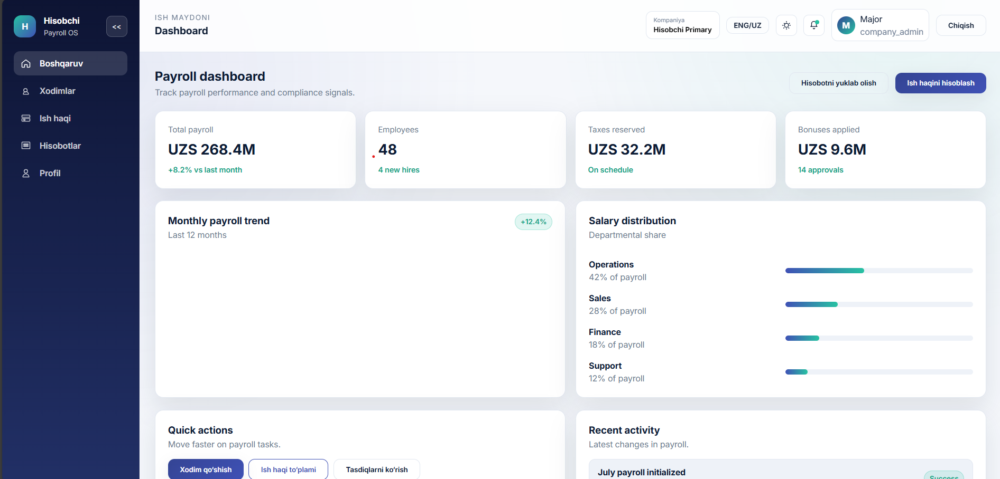
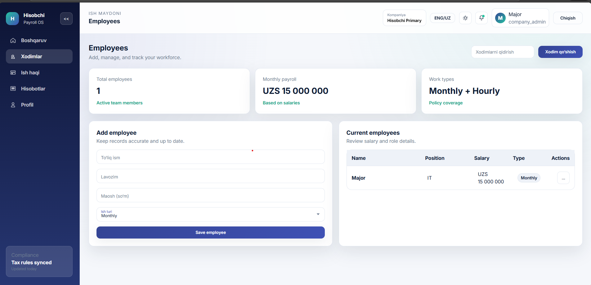
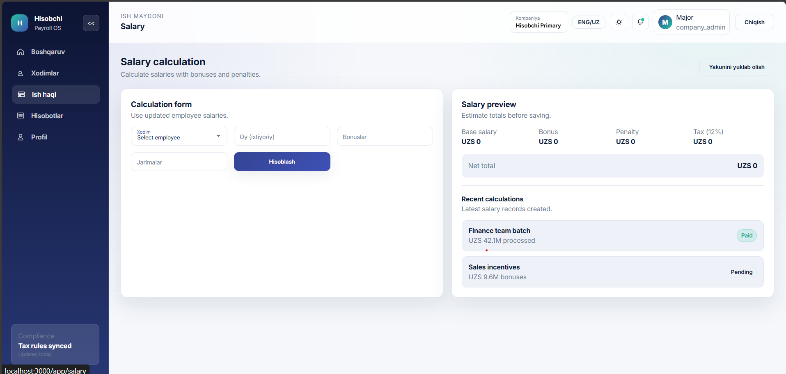

# Hisobchi.uz

Production-ready accounting and payroll automation platform for small and medium businesses in Uzbekistan.

## Project Structure

- `backend` - Node.js + Express REST API with MongoDB
- `frontend` - React SPA

## Backend Setup

1. Copy `.env.example` to `.env` and update values.
2. Install dependencies:
   - `cd backend`
   - `npm install`
3. Start the API:
   - `npm run dev`

## Frontend Setup

1. Install dependencies:
   - `cd frontend`
   - `npm install`
2. Start the SPA:
   - `npm start`

Frontend requests default to `/api` and use CRA proxy to reach the backend on
`http://localhost:5000`. For custom environments set `REACT_APP_API_URL`.

## Default Roles

- `super_admin`
- `company_admin`
- `employee`

## API Base URL

Frontend expects `/api` by default or configure `REACT_APP_API_URL`.

## Registration Flow

Registration requires a company name. The backend creates the company and links it
to the new user during `/auth/register`, so the account is ready for employee and
salary operations immediately.

## Production Build

1. Build the frontend:
   - `cd frontend`
   - `npm run build`
2. Start the backend in production:
   - `cd backend`
   - `npm start`

The backend serves the React build when `NODE_ENV=production`. The included Nginx
config in `deployment/nginx/hisobchi.conf` can proxy `/api` and serve the static
build directly.

## Recent Operational Updates

- Added company setup during registration to prevent null `companyId` flows.
- Enforced company presence for employee and salary endpoints.
- Defaulted frontend API base to `/api` with local proxy support.
- Added production static serving from the backend for single-host deployments.

<h1>PLATFORMA KO'RINISHI</h1>
<h3>kirish qismi</h3>

<h3>1-sahifa</h3>

<h3>2-sahifa</h3>

<h3>3-sahifa</h3>
